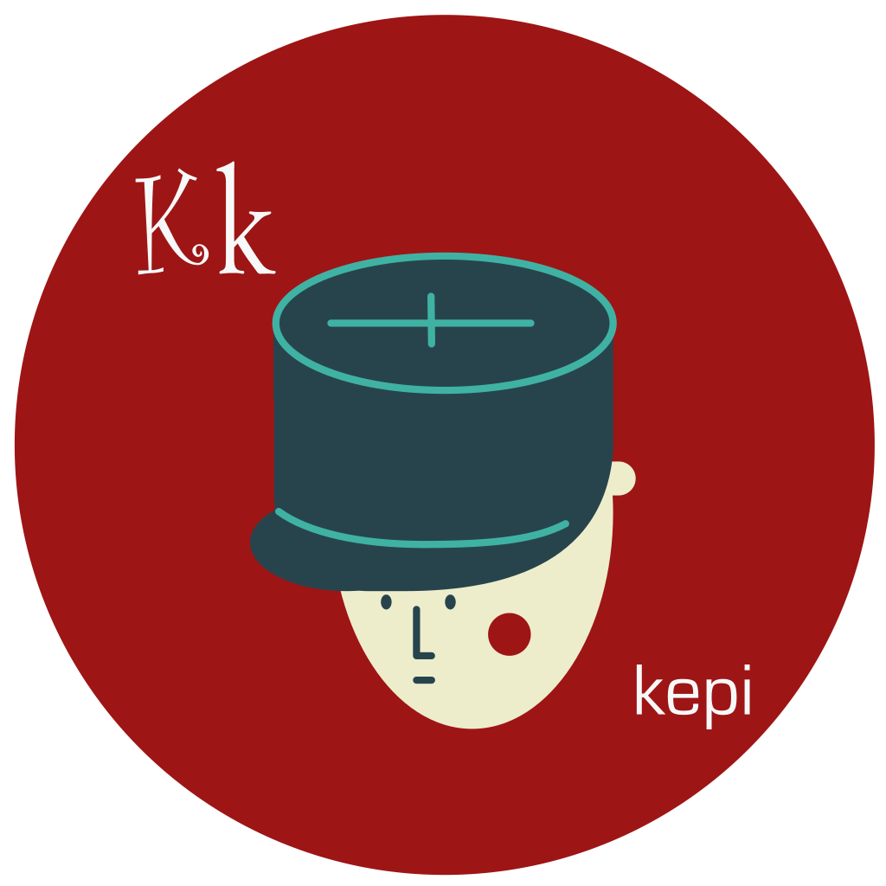

# Kepi is a small, elegant, and dependency free library for setting HTTP response headers.

	 
	

		
	

	 
	 
	 

## Usage

### Example Configuration

Simplest is to have as much as possible in a constant object ("declarative")

    const Kepi = require('kepi');

    let kepi = Kepi({
      'X-Powered-By': 'super duper system',
      'Content-Type': ['text/html', 'charset=utf-8']
      'Feature-Policy': {
        vibrate: "'none'",
        geolocation: "'self'",
      },
    });

Later, you can add more headers declaratively

    kepi.add( {Content-Encoding: ['deflate', 'gzip']} );

But sometimes you just need to add stuff dynamically

    let methodArray = [ insert methods you allow here ]
    kepi.accessControl.allowMethods().add(...methodArray);
    kepi.header('Expires').set(Date.now() + 60*60*1000);  // good for one hour

### In roll your own code

    kepi.applyTo(myResponse);

### In Express

    app.use(kepi.middleware());

#### - If you just want to mimic (more or less) [helmet](https://www.npmjs.com/package/helmet)

    app.use(kepi().safe().middleware());
    
### In [Micro](https://github.com/zeit/micro)  (note: not tested in a real app!)

    originalMicroHandler = (req, res) => { ... }
    module.exports = kepi.micro(originalMicroHandler);
    

## API

### Kepi

#### constructor(data, customOptions)
 data can be
  - null
  - an Object (see [example](#example-configuration) above).  In may cases this is all you really need.
  - "safe": same as calling [safe()](#safe-1)

 customOptions are described under [Customization](#Customization) below

#### add(data)
Add that data object to the headers.  (same logic as for constructor, including "safe")

#### applyTo(response)
Write the headers into response.

#### header(headerName, optionalData)
Retrieve the Header with that name, creating if necessary, setting with optional data.  Name may be
 - the full name, e.g. "Content-Security-Policy"
 - a "nickname", e.g. "contentSecurityPolicy" (see [Customization](#customization))

#### middleware()
For use in Express.  Should be modifiable for others

#### safe()
Sets all headers in options.SAFE or options.safe, creating if needed.

### Header - base class for the following subclasses

#### Value
 - a single value (usually a String)
 - _e.g._ Transfer-Encoding

#### DateValue
 - a single Date,
 - _e.g._ Expires
 - numbers get converted to a Date, null or 0 to current date.

#### List
 - a list of values, usually comma delimited (but sometimes semicolon)
 - _e.g._ Content-Encoding (comma) or Strict-Transport-Security (semicolon)

#### Policies
 - one or more semicolon delimited Policies
 - each Policy consists of a name and space delimited values.
 - _e.g._ Content-Security-Policy

#### Header Methods

#### add(data)
Adds data to the header value
  - `List.add(...items)`
    - _e.g._ `add('a','b')` is equivalent to `add(['a','b'])`
  - `Policies.add(policyNameorData, ...items)`
    - if first argument is a String, adds items to that policyNae
    - else parses policyNameorData as a data object
  - **note** items will be flattened one level deep, so `add('a','b')` is equivalent to `add(['a','b'])`

#### applyTo(response)
Write the header to the response.  You will seldom call this directly.

#### clear()
Clear the value, to "", [], or {} as appropriate
  - `Policies.clear(policyName)` takes an optional policy name, if provided, only that policy is cleared.

#### remove()
Flags this header to be removed from any response.  **Warning:** cannot be "unflagged".

#### safe()
Set the header to a "safe" value, as provided in the options.

#### set(value)
Sets the value
  - `List.set(...items)` like add(), items will be flattened

## Customization

You can customize or add to behavior by passing a customOptions parameter to the Kepi function.
This will get `Object.assign`ed onto the default settings in defaults.js.

#### Simple Options
  - setupNicknames (default = true) controls if nicknames are setup
  - resetAfterApply (default = false) will reset to initial data after calling applyTo()

#### Complex Options
Since `Object.assign` is shallow, and making a deep copy is a bit of a pain, instead, provide complex user options in the **lowercase**
properties given at the end of defaults.js.

 - headerClasses allows you to add or override the class for a Header
 - nicknames lets you add nickname shortcuts (but see `setupNicknames`)
   - _e.g._ you can use `kepi.featurePolicy()` instead of `kepi.header("Feature-Policy")`
     - **Note**: Unlike in **helmet**, you must add parentheses at the end.
 - safe allows you to add or override the "security safe" values for headers

## Notes, Todos, and Caveats

This work was inspired when I ran a [Security Header Audit](https://securityheaders.com/) on one of my websites and got back a lot of angry red.  This quickly lead me to [helmet](https://www.npmjs.com/package/helmet), a popular, well tested, and well documented Express middleware.  However, helmet really only sets "secure" headers, and is of little use setting general purpose response headers.  It has a many dependencies and sucks down a lot of code.

To my surprise, I didn't see any general purpose "setup your response headers" npm module.  This is my attempt to fill that need.
